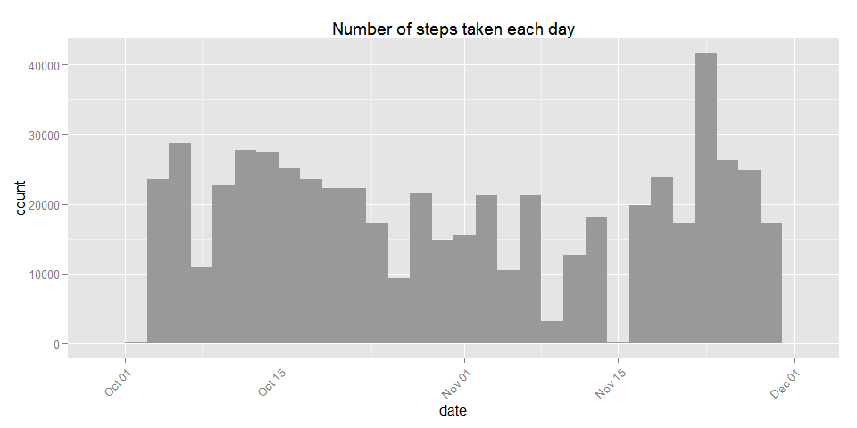
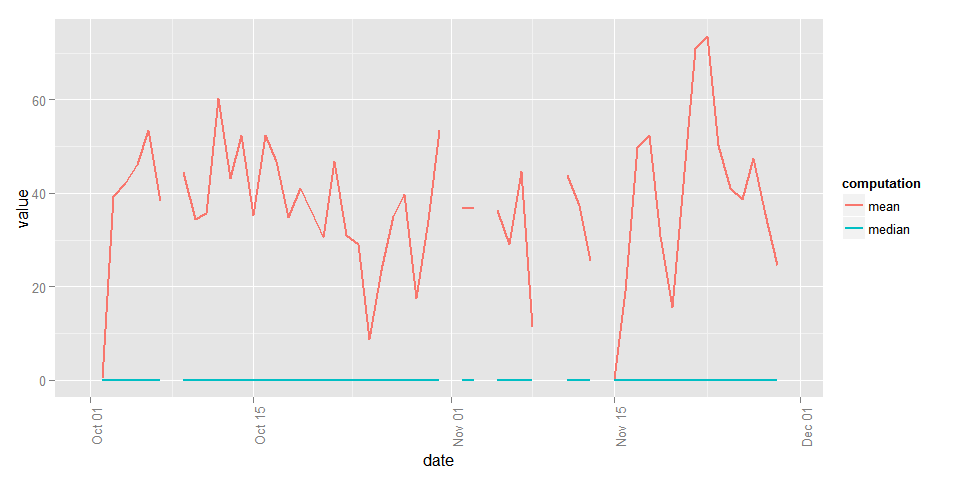
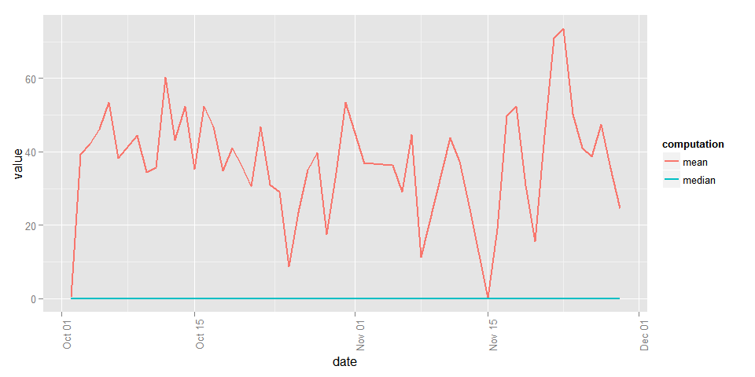
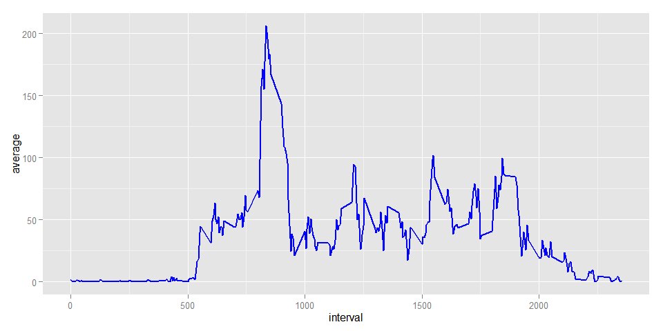
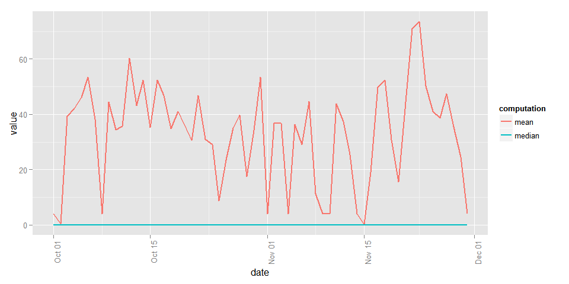
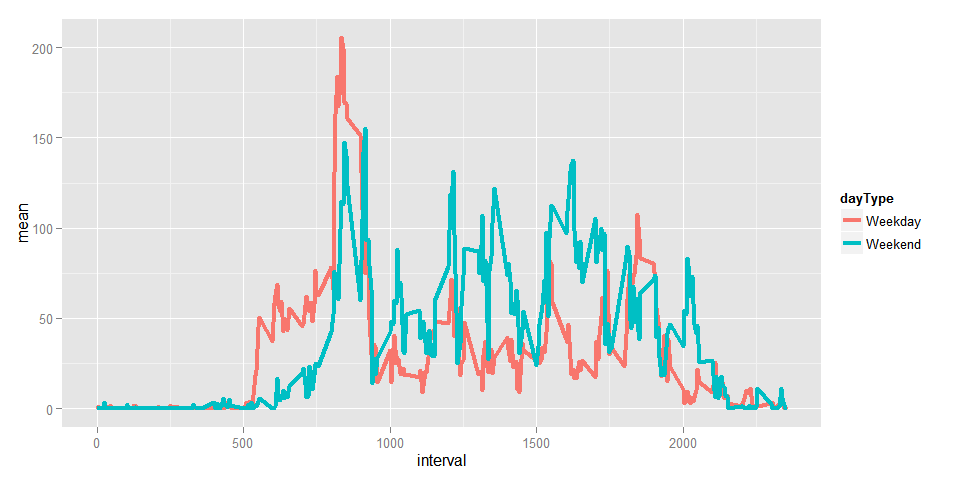

# Reproducible Research: Peer Assessment 1

## Loading and preprocessing the data

The first step is to set the global variables for our markdown


```r
library(knitr)
opts_chunk$set(fig.width=10, cache=TRUE)
```

The second step is to unzip the file and see what the name of the file is. 


```r
unzip("activity.zip")
list.files()
```

```
##  [1] "activity.csv"            "activity.zip"           
##  [3] "doc"                     "instructions_fig"       
##  [5] "KnitRGraph.PNG"          "KnitrPlot"              
##  [7] "PA1 Documentation.Rmd"   "PA1_Documentation.html" 
##  [9] "PA1_Documentation.md"    "PA1_Documentation.Rmd"  
## [11] "PA1_Documentation_cache" "PA1_Documentation_files"
## [13] "PA1_template.html"       "PA1_template.md"        
## [15] "PA1_template.Rmd"        "PA1_template_cache"     
## [17] "README.html"             "README.md"              
## [19] "RStudioPlot.png"
```

We can see that this file is called activity.csv so the next step is to load the
data and look at some of the basic statistics about the it.


```r
activityData <- read.csv("activity.csv")
str(activityData)
```

```
## 'data.frame':	17568 obs. of  3 variables:
##  $ steps   : int  NA NA NA NA NA NA NA NA NA NA ...
##  $ date    : Factor w/ 61 levels "2012-10-01","2012-10-02",..: 1 1 1 1 1 1 1 1 1 1 ...
##  $ interval: int  0 5 10 15 20 25 30 35 40 45 ...
```

```r
head(activityData)
```

```
##   steps       date interval
## 1    NA 2012-10-01        0
## 2    NA 2012-10-01        5
## 3    NA 2012-10-01       10
## 4    NA 2012-10-01       15
## 5    NA 2012-10-01       20
## 6    NA 2012-10-01       25
```

We can see that one of the columns is a date column. I personally prefer to use
the lubridate package for dealing with dates so I will just transform that 
column with the help of the function ymd. If you want to find out more about 
lubridate there is a very interesting article [here](http://www.r-statistics.com/2012/03/do-more-with-dates-and-times-in-r-with-lubridate-1-1-0/). Finally, we will check that the date has been transformed correctly. It should now be of POSIX format


```r
library(lubridate)
activityData$date <- ymd(activityData$date)
str(activityData)
```

```
## 'data.frame':	17568 obs. of  3 variables:
##  $ steps   : int  NA NA NA NA NA NA NA NA NA NA ...
##  $ date    : POSIXct, format: "2012-10-01" "2012-10-01" ...
##  $ interval: int  0 5 10 15 20 25 30 35 40 45 ...
```

Finally, I am transforming the data set to a data.table for ease of calculating 
the various graphs and aggregations required.


```r
library(data.table)
```

```
## 
## Attaching package: 'data.table'
## 
## The following objects are masked from 'package:lubridate':
## 
##     hour, mday, month, quarter, wday, week, yday, year
```

```r
activityData <- as.data.table(activityData)
```

## What is mean total number of steps taken per day?

The first step to do this is to create a summary of the total number of steps for
each day and store it into a new table. Next, we display the histogram. FOr that we have to load the ggplot2 package


```r
dailyTotal <- activityData[, .(stepsSum = sum(steps)), by=date]
library(ggplot2)
g <- ggplot(dailyTotal, aes(date))
g <- g + geom_histogram(aes(weight = stepsSum), fill = "#999999")
g <- g + theme(axis.text.x = element_text(angle = 45, hjust = 1))
g <- g + ggtitle("Number of steps taken each day")
g
```

 


We can now compute the mean and median values. Using data.table functionality
this can be achieved in a single call. Please note that there is a gimmick with
using data.table and computing the median value of a colum. This problem is
discussed in detail [here](http://stackoverflow.com/questions/12125364/why-does-median-trip-up-data-table-integer-versus-double)

Following the computation of the aggregate table we can then easily display these
values using ggplot


```r
library(dplyr)
library(tidyr)
activityMeanMedian <- activityData[, .(mean = mean(steps)
                        , median = as.double(median(steps, na.rm = TRUE))),by=date]
activityMeanMedian <- activityMeanMedian %>% gather(computation, value, - date)
```

Computing the graph:


```r
g1 <- ggplot(activityMeanMedian, aes(date, value, color = computation))
g1 <- g1 + theme(axis.text.x = element_text(angle = 90, hjust = 1))
g1 <- g1 + geom_line(size = 1, method="loess", aes(group = computation))
g1
```

 

It can be seen that for the the dates where the values were NA there is a gap in
the line that was drawn. This could be removed by adding an additional check to the
data set when using gplot


```r
g <- ggplot(activityMeanMedian[!is.na(activityMeanMedian$value)]
            , aes(date, value, color = computation))
g <- g + theme(axis.text.x = element_text(angle = 90, hjust = 1))
g + geom_line(size = 1, method="loess", aes(group = computation))
```

 

## What is the average daily activity pattern?

1. This graph below reports the 5 minute interval


```r
intervalMean <- activityData[,.(average = mean(steps, na.rm = TRUE)),by=interval]
intervalMean <- cbind(intervalMean, s = seq_along(intervalMean$average))
g <- ggplot(intervalMean, aes(interval, average))
g <- g + geom_line(size = 1, color = "blue")
g
```

 

2. The internval with the maximum value can be found by sorting the on the value of
the average


```r
intervalMean[order(-rank(average))][1]
```

```
##    interval  average   s
## 1:      835 206.1698 104
```
## Imputing missing values

###Total number of missing values
Total number of missing values in the dataset is 2304


```r
table(is.na(activityData$steps))
```

```
## 
## FALSE  TRUE 
## 15264  2304
```

### Strategy for replacing null values

The strategy that I have chosen for replacing the NA values is to repalce them
with the median for the 5 minute interval which they belong to. We first compute the median values, we left join it with our facts table and then we use mutate to 
replace the values that are na.


```r
intervalMean <- activityData[,.(average = median(steps, na.rm = TRUE)),by=interval]
noNaActivityData <- merge(x = activityData, y = intervalMean, by = "interval")
noNaActivityData <- noNaActivityData[order(date,interval)]
noNaActivityData <- mutate(noNaActivityData, steps = replace(steps, is.na(steps), noNaActivityData$average))
```

```
## Warning in replace(steps, is.na(steps), noNaActivityData$average): number
## of items to replace is not a multiple of replacement length
```

```r
noNaActivityData[, average:=NULL]
noNaActivityData$steps <- as.numeric(format(noNaActivityData$steps, digits = 2))
```

### Creating a new structure without the new values

This was achieved in the previous task

### Display the mean and average of the new data set

Calculate the means and the median


```r
activityMeanMedian <- noNaActivityData[, .(mean = mean(steps)
                        , median = as.double(median(steps))),by=date]
activityMeanMedian <- activityMeanMedian %>% gather(computation, value, - date)
```

Display the graph associated with this


```r
g2 <- ggplot(activityMeanMedian, aes(date, value, color = computation))
g2 <- g2 + theme(axis.text.x = element_text(angle = 90, hjust = 1))
g2 <- g2 + geom_line(size = 1, method="loess", aes(group = computation))
g2
```

 

As a reminder, this is how the original graph looked like where we did not display the NA values


```r
g1
```

 
## Are there differences in activity patterns between weekdays and weekends?

The first step is to add a new column with the day of the week for each entry


```r
dataSetNoNA <- noNaActivityData
dataSetNoNA[, weekdayname := weekdays(dataSetNoNA$date)]
dataSetNoNA$weekdayname <- factor(dataSetNoNA$weekdayname)
weekday <- ifelse(dataSetNoNA$weekdayname =="Sunday", "Weekend"
                  , ifelse(dataSetNoNA$weekdayname == "Saturday"
                           , "Weekend","Weekday"))
dataSetNoNA[,dayType := weekday]
dataSetNoNA$dayType <- factor(dataSetNoNA$dayType)
```

We can verify that our calculations were correct by using a simple table


```r
table(dataSetNoNA$weekdayname, dataSetNoNA$dayType)
```

```
##            
##             Weekday Weekend
##   Friday       2592       0
##   Monday       2592       0
##   Saturday        0    2304
##   Sunday          0    2304
##   Thursday     2592       0
##   Tuesday      2592       0
##   Wednesday    2592       0
```

As we can see from above the calculations are correct. We can now move to calculating
the average for each interval for each day type


```r
dataSetNoNA <- dataSetNoNA[,.(mean = mean(steps)), by=.(interval,dayType)]
head(dataSetNoNA)
```

```
##    interval dayType       mean
## 1:        0 Weekday 2.02222222
## 2:        5 Weekday 0.40000000
## 3:       10 Weekday 0.15555556
## 4:       15 Weekday 0.17777778
## 5:       20 Weekday 0.08888889
## 6:       25 Weekday 1.31111111
```

As you can see this look correct so we can now plot this

```r
g <- ggplot(dataSetNoNA, aes(interval, mean, color = dayType))
g + geom_line(aes(color = dayType), size = 1.5)
```

 
